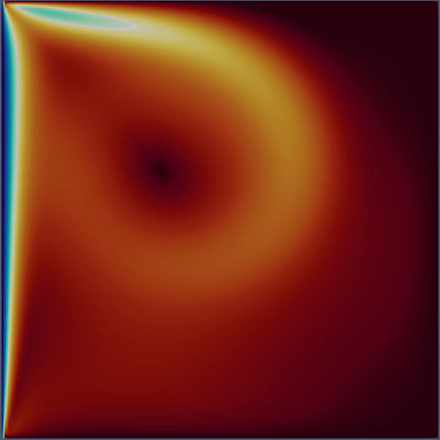
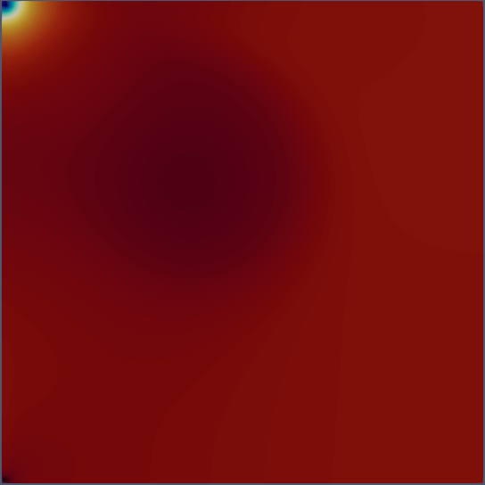
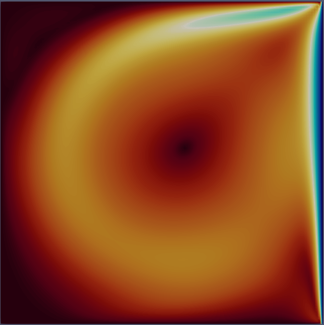
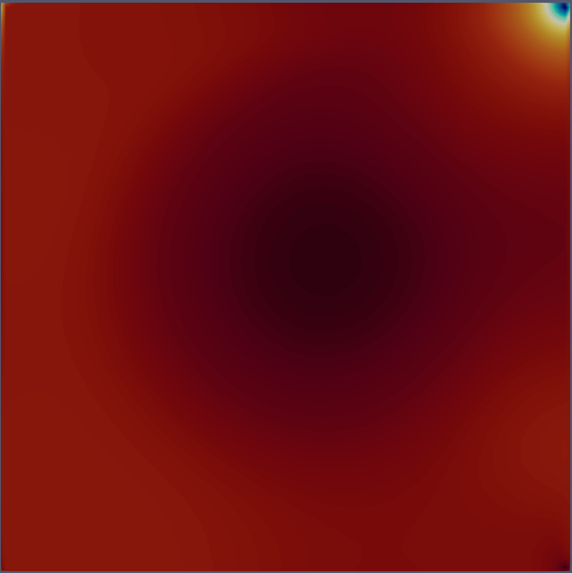
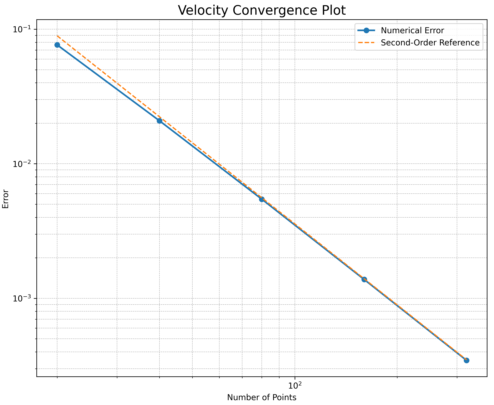
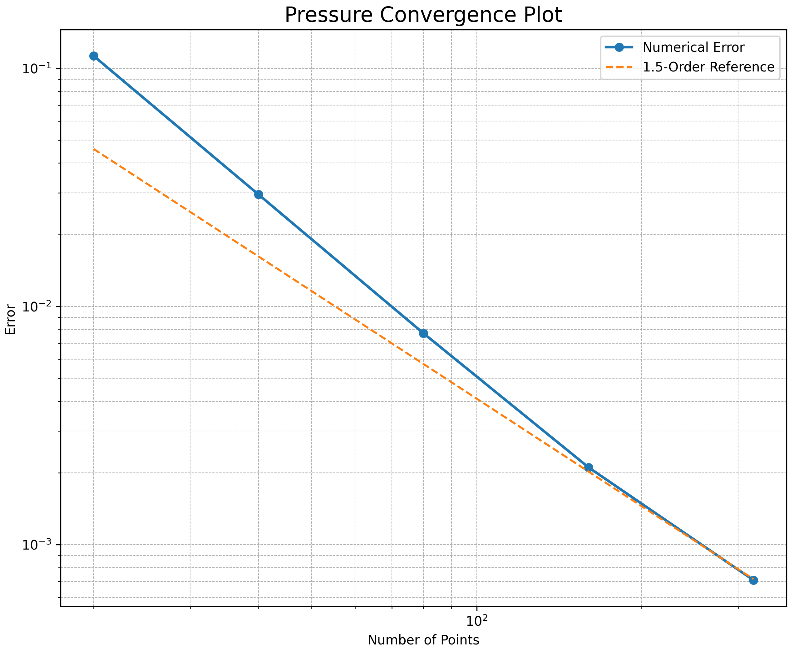
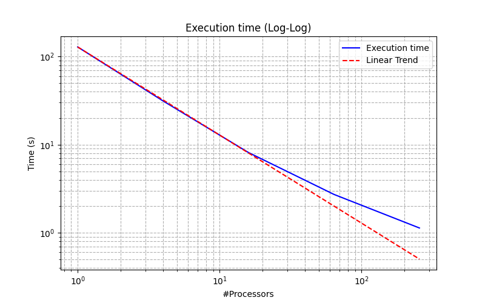
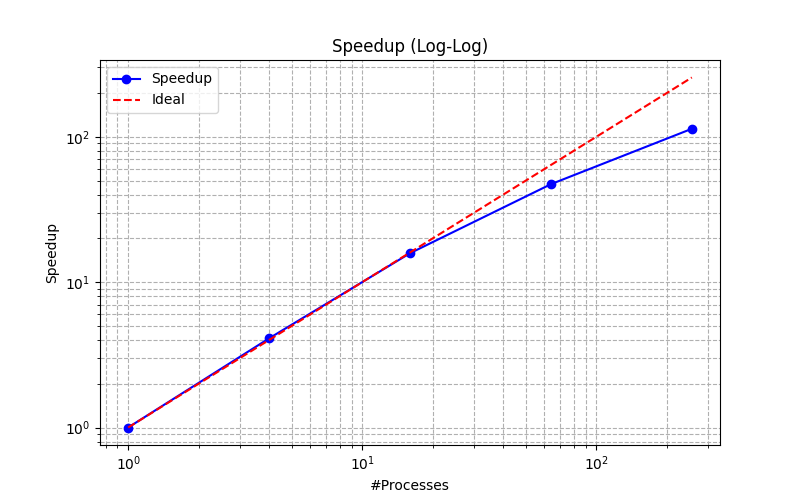

# Aerospace-Group-B-Module-1

Repository for the project related to the "High Performance Scientific Computing in AeroSpace" course.
The objective was to develop a high-performance solver for the incompressible Navier–Stokes equations, implemented
in C++ using the finite differences method on a staggered mesh.
To enhance computational efficiency, we employed a parallelization strategy combining MPI for velocity computations and a
pressure solver that utilizes FFTW in conjunction with 2Decomp.

## Building and Running

Compilation is handled by a Makefile that requires as dependencies:

- __MPI__
- __FFTW3__

We used __mk modules__ by the __MOX__ laboratory of __Politecnico di Milano__. You can find them [here](https://github.com/pcafrica/mk).

Then just run

```bash
make
```

That will create the ./build directory with the executable.

### Error Calculate Build

To run the code you need to specify a path to a file with the inputs in the form of [input](input.in) file, where test case number is used to specify boundary conditions.
Test 0 is reserved for error calculation, and can be run via:

```bash
cd build
mpirun -n X ./main ../input.in   # Where X is number of processes 
```

Need to de-comment "#define ERROR" first and recompile

### Test Build

Test 1 & 2 represent a lid-driven cavity.
More test can be implemented adding more boundary condition is the [respective file](./src/setBoundaries.cpp) following the schema, and creating an appropriate testN.in.

```bash
cd build
mpirun -n X ./main ../testN.in
```

### Clean Build

```bash
make clean
```

### Small note

Complications with 2 decomp compatibility lead to have only codes where every processor has the same number of points for pressure being able to run.

## Results

Outputs of simulation can be found in the [results](results) directory, where the .vtk files can be opened in paraview to show a plane dividing in half the domain for each direction, where you can see single velocity components, pressure or total velocity magnitude.

### Test1

The test case 1 consists in a three-dimensional lid-driven cavity with Dirichlet boundary
conditions on all the 6 faces, where we fix the velocity on y axis to 1 and the other faces to 0. The result shown is a plane cutting the cube on z=0 of a simulation with 120x120x120
pressure points at 8 seconds.
Here we show the vortex created along the z plane in both velocity and pressure.

   

### Test2

The test case 2 is a lid-driven where we have periodic boundaries in the z direction. The
result shown is a plane cutting the cube on z=0 of a simulation with 120x120x120 pressure
points at 20 seconds
Here we show the vortex created along the z plane in both velocity and pressure.

   

### Analysis

### Error convergence

Error has been measured on grids of increasing dimension and decreasing timestep with respect to CFL condition, results show convergence of grade 2 for velocity and around 1.5 for pressure:

   


### Time scalability

Time scalability test were performed on an HPC cluster using up to 256 cores on a 320x320x320 grid:

   

## Documentation

Additional documentation can be found in the doc directory.
